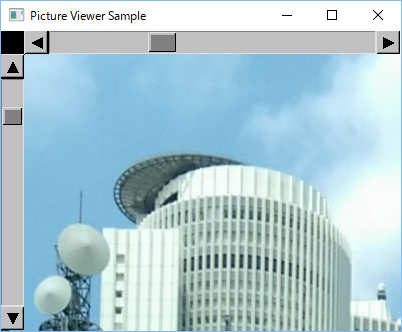

# Scroll bar for openFrameworks

(C) 2016- H.Hiro <main@hhiro.net>

## Overview

This program provides scroll bars for [openFrameworks](http://openframeworks.cc/ "openFrameworks"): C++-based multi-platform graphical software library.

## Try the sample

This sample is for Visual C++ 2015; Visual-C++-specific code is included only for selecting picture files (built-in `ofSystemLoadDialog` cannot give correct file name if it includes non-ASCII characters). To try this,

1.  Follow [the instruction for setting up visual studio 2015 for openFrameworks](http://openframeworks.cc/setup/vs/ "visual studio | openFrameworks"). You will find three files: `main.cpp`, `ofApp.cpp` and `ofApp.h`.
2.  Replace them with the files in the repository, and put `ScrollBar4OF.hpp` together with them (in the same folder).
3.  Run the program.

## How to use

Sorry for not preparing the detailed document.

An important point is that the following methods for the scroll bars should be invoked in `ofApp::[The same method name]`:

-   `mousePressed`
-   `mouseDragged`
-   `mouseReleased`
-   `update`
-   `draw`

## LICENSE

Released under the MIT License. See `LICENSE` file for the full text.

# openFrameworks用スクロールバー

## 概要

[openFrameworks](http://openframeworks.cc/ "openFrameworks")（C++ベース・マルチプラットフォームなグラフィカルソフトのためのライブラリ）で利用するためのスクロールバーです。

## 試す

サンプルはVisual C++ 2015向けのみ作っています。なお、Visual C++に特化したコードは、画像ファイルを選択する部分のみです（`ofSystemLoadDialog`という組み込みの関数もありますが、非ASCII文字のファイル名を正しく扱えないという問題があるため使っていません）。これを試すには以下のようにしてください。

1.  [openFrameworksのVisual Studio 2015向けセットアップ（英語）](http://openframeworks.cc/setup/vs/ "visual studio | openFrameworks")の手順に従って準備をします。このとき、`main.cpp`・`ofApp.cpp`・`ofApp.h`の3つのファイルができます。
2.  上記の3つのファイルを、当レポジトリにあるファイルで置き換えます。さらに、`ScrollBar4OF.hpp`も同じフォルダに一緒に置きます。
3.  プログラムを実行します。

## 使い方

恐れ入りますが、詳細なドキュメントは用意していません。

重要な点として、スクロールバーの以下のメソッドを、`ofApp::[同名のメソッド]`で呼ぶ必要があります。

-   `mousePressed`
-   `mouseDragged`
-   `mouseReleased`
-   `update`
-   `draw`

## ライセンス

MIT Licenseで提供します。本文（英語）は「LICENSE」ファイルをご覧ください。
